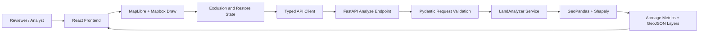

# Buildable Land Analysis

Buildable Land Analysis is a full-stack geospatial application for estimating usable parcel acreage after applying wetland setbacks, manual exclusion areas, and restoration overrides. It combines a FastAPI analysis service with a React and MapLibre frontend for interactive map review.

## 1. Problem Statement

Land due diligence often requires a fast, defensible estimate of how much of a parcel can be developed after environmental constraints are applied. Wetlands, statutory or policy setback buffers, and reviewer-defined constraints can materially reduce usable acreage. Manual review is possible in desktop GIS tools, but it is slow, difficult to reproduce, and awkward for iterative scenario testing.

This project addresses that gap by providing an interactive workflow where engineering and planning users can submit parcel and wetland GeoJSON, apply setback distances, draw manual exclusions or restore areas, and receive updated acreage metrics and GeoJSON layers.

## 2. Solution Overview

The application accepts parcel and wetland geometries, projects them into an equal-area coordinate reference system for measurement, computes excluded and buildable geometries with Shapely and GeoPandas, and returns acreage summaries plus renderable GeoJSON.

Core capabilities include:

- Wetland setback buffering.
- Buildable area calculation from parcel minus excluded land.
- Manual exclusion polygons for user-defined unbuildable areas.
- Manual restore polygons that return portions of excluded land to buildable status.
- Interactive map drawing and layer updates in the browser.
- API-first design suitable for automation, testing, or integration with external GIS workflows.

## 3. Architecture Diagram



The frontend is responsible for interaction, visualization, and request assembly. The backend owns validation, coordinate reprojection, geometry repair, spatial operations, acreage calculations, and response formatting.

## 4. GIS Workflow

The analysis workflow is:

1. Parse parcel, wetland, manual exclusion, and manual restore GeoJSON inputs.
2. Validate polygon geometry structure and reject invalid manual polygons.
3. Repair invalid geometries where possible before analysis.
4. Reproject geometries to `EPSG:5070` for equal-area calculations.
5. Union parcel geometry into a single working boundary.
6. Union wetland geometries and compute wetland area inside the parcel.
7. Buffer wetlands by the requested setback distance.
8. Clip buffered wetlands to the parcel to create the initial excluded geometry.
9. Union manual exclusion polygons and add their parcel-clipped area to excluded geometry.
10. Union manual restore polygons, intersect them with excluded geometry, and return that intersection to buildable geometry.
11. Remove restored geometry from excluded geometry.
12. Recalculate parcel, wetland, buffer, excluded, and buildable acreage.
13. Reproject output layers to `EPSG:4326` for web map rendering.
14. Return GeoJSON FeatureCollections for buildable and excluded areas.

## 5. Data Sources

The current application uses GeoJSON inputs supplied by the client. The sample frontend includes a small parcel and wetland geometry for demonstration and development.

Expected production data sources may include:

- Parcel boundary data from county GIS portals, assessor systems, or cadastral datasets.
- Wetland polygons from the U.S. Fish and Wildlife Service National Wetlands Inventory or jurisdiction-specific environmental layers.
- Locally curated constraint layers such as easements, floodways, protected habitat, utility corridors, or slope exclusions.
- User-drawn manual polygons captured during review.

All source datasets should be normalized to valid polygonal GeoJSON before submission. The backend assumes incoming coordinates are WGS84 longitude and latitude unless callers extend the API contract to include CRS metadata.

## 6. Setback Assumptions

The API accepts `setback_distance` as a numeric buffer distance. Backend calculations treat this value as meters after reprojection to `EPSG:5070`.

Important assumptions:

- The setback is applied uniformly around all wetland geometries.
- Wetland buffer areas are clipped to the parcel boundary.
- Manual exclusions are clipped to the parcel before being added to excluded geometry.
- Restore polygons only affect land that is already excluded; they do not create buildable land outside the parcel.
- Acreage metrics are derived from projected square-meter geometry areas and converted to acres.

The frontend label currently describes setback distance in feet, while the backend treats the value as meters. This should be reconciled before production use by either converting feet to meters in the frontend or changing the API contract and backend naming.

## 7. API Design

### Analyze Land

`POST /api/v1/analyze`

Request body:

```json
{
  "parcel_geojson": {
    "type": "FeatureCollection",
    "features": []
  },
  "wetlands_geojson": {
    "type": "FeatureCollection",
    "features": []
  },
  "setback_distance": 50,
  "manual_exclusions": [],
  "manual_restore_areas": []
}
```

Key request fields:

- `parcel_geojson`: Required GeoJSON parcel boundary. Supports FeatureCollection or Feature-style payloads.
- `wetlands_geojson`: Required GeoJSON wetland geometry collection. Empty collections are supported.
- `setback_distance`: Required non-negative buffer distance.
- `manual_exclusions`: Optional list of GeoJSON Feature polygons.
- `manual_restore_areas`: Optional list of GeoJSON Polygon or MultiPolygon geometries.

Response body:

```json
{
  "parcel_area_acres": 247.11,
  "wetland_area_acres": 9.88,
  "wetland_buffer_area_acres": 11.83,
  "excluded_area_acres": 21.71,
  "buildable_area_acres": 225.4,
  "buildable_geojson": {
    "type": "FeatureCollection",
    "features": []
  },
  "excluded_geojson": {
    "type": "FeatureCollection",
    "features": []
  }
}
```

Validation errors return HTTP 400. Unexpected analysis failures return HTTP 500 with a diagnostic message.

## 8. Frontend Features

The frontend provides an interactive review surface built with React, TypeScript, MapLibre, and Mapbox Draw.

Current features:

- Initial analysis execution on page load.
- Setback input and rerun control.
- Rendered parcel boundary, excluded geometry, buildable geometry, manual exclusions, and restore areas.
- Draw Exclusion workflow for red user-defined exclusion polygons.
- Draw Restore workflow for blue restoration polygons.
- Separate local state for exclusion and restore polygons.
- Automatic API rerun after drawing exclusions or restore areas.
- Summary cards for parcel, wetland, excluded, buildable, and derived metrics.
- Sidebar counts for drawn exclusions and restore areas.
- Loading skeletons and error presentation.

## 9. Performance Considerations

The backend performs geometry-heavy operations that can become expensive with large or highly detailed polygons.

Important considerations:

- `EPSG:5070` improves area accuracy for U.S. workflows but may be inappropriate for international parcels.
- Buffer operations can produce high-vertex geometries, especially with large setback distances or complex wetland boundaries.
- Output simplification is applied before returning GeoJSON to reduce transfer size and improve map performance.
- Union and difference operations are sensitive to invalid geometry; geometry repair is performed before analysis.
- For large datasets, upstream simplification, tiling, spatial indexing, or asynchronous job execution may be required.
- The frontend currently sends full GeoJSON payloads on each analysis request. Large production datasets may need upload references, server-side caching, or persisted scenario IDs.

## 10. Future Improvements

Recommended next steps:

- Resolve the frontend/backend setback unit mismatch.
- Add automated backend tests for exclusions, restore areas, empty inputs, invalid geometries, and overlapping polygons.
- Add frontend tests for draw completion, request payload assembly, and metric refresh.
- Support CRS metadata or automatic local projection selection outside the continental United States.
- Add import/export workflows for parcel, wetland, exclusion, restore, and result layers.
- Persist analysis scenarios and user-drawn polygons.
- Add layer toggles, polygon deletion, restore clearing, and per-feature editing.
- Split large frontend bundles with dynamic imports.
- Add authentication and audit logging for production review workflows.
- Integrate authoritative wetland and parcel data sources directly.

## 11. Running Locally

### Prerequisites

- Python 3.9+
- Node.js 18+
- npm

### Backend

```bash
cd backend
python3 -m venv .venv
source .venv/bin/activate
pip install -r requirements.txt
uvicorn app.main:app --reload
```

The backend runs at:

```text
http://127.0.0.1:8000
```

The API endpoint is:

```text
http://127.0.0.1:8000/api/v1/analyze
```

### Frontend

```bash
cd frontend
npm install
npm run dev
```

The Vite dev server usually runs at:

```text
http://127.0.0.1:5173
```

### Docker Compose

If Docker is available, the repository also includes a compose file:

```bash
docker compose up --build
```

Use this path when validating the full stack in an environment closer to deployment.
